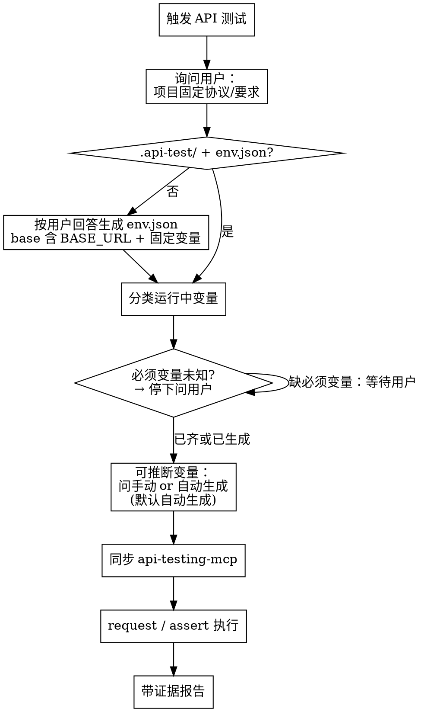

# 自动 API 接口测试

## 概述

**环境文件是唯一真相来源。** 一切 API 接口测试（探索、单接口验证、批量回归）均通过 `api-testing-mcp` 执行；变量以 `.api-test/env.json` 为准。

**违反字面规则就是违反精神：** 未校验 env、未获用户确认的**必须**参数，一律不得发请求。

## 何时使用

- 用户要求测试 / 调用 / 验证 API 接口
- 规格、plan 含接口测试或回归测试章节
- 功能开发后需用 HTTP 验证行为
- 保存、复跑接口用例集合

**不适用：** 纯单元测试、无 HTTP 的前端改动、api-testing-mcp 未配置（先提示配置 MCP）。

## 铁律

```
1. 无 env.json 或 BASE_URL 未确认 → 禁止发请求
2. 必须且未知的运行中变量 → 必须停下等待用户输入
3. 运行时环境 → 严格来自 env.json（同步后传给 MCP）
4. 无 assert/request 输出 → 禁止宣称测试通过
```

## 工作流



## 步骤 0：询问固定环境要求（每次新环境或 env.json 不存在时）

**必须先问用户：**

> 当前项目的 API 测试环境，有哪些固定协议/要求？（例如：BASE_URL、请求头规范、认证方式、公共 Header、路径前缀等）

从用户回答中**提取固定变量**写入 `env.json` 的 `base`。**仅 `BASE_URL` 为默认必填**；`TOKEN` 等仅为示例——只有用户明确列为固定要求时才写入 `base`。

示例：用户回复「请求头固定带 token，值为 xxx，BASE 是 http://10.0.0.1:7000」→

```json
"base": {
  "BASE_URL": "http://10.0.0.1:7000",
  "TOKEN": "xxx"
}
```

并在后续请求中按用户描述的 Header 名/格式使用（如 `token: {{TOKEN}}`）。

## 步骤 1：准备工作区

1. 创建 `.api-test/`（若不存在；含密钥的 `env.json` 可加入 `.gitignore`）
2. 检查 `.api-test/env.json`；不存在则按步骤 0 回答生成

## 步骤 2：env.json 格式

`projectName` = 工作区根目录名。

```json
{
  "env_name": "default_{{projectName}}",
  "env_value": {
    "base": {
      "BASE_URL": "http://127.0.0.1"
    },
    "workspace": {
      "<sessionId>": {
        "userId": "real-id-from-user"
      }
    }
  }
}
```

- **`base`**：固定变量；**至少含 `BASE_URL`**，其余来自步骤 0 用户确认的固定要求
- **`workspace[<sessionId>]`**：本任务运行中变量；**每个任务必须分配唯一 `sessionId`**（建议 UUID），单任务与并行任务均使用

模板见 `env.template.json`。

### 校验（阻断级）

| 条件 | 处理 |
|------|------|
| `base.BASE_URL` 缺失、为空或占位符 | **停下**，向用户索取 |
| 用户声明的固定变量（如 TOKEN）在 base 中缺失 | **停下**，向用户索取 |
| **必须**运行中变量未知（见下节） | **停下**，列出清单等待输入 |

占位符视为未知：`eg`、`example`、`TODO`、`<待填>`。

## 步骤 3：运行中变量分类

### A. 必须由用户指定（阻断）

业务上无法推断、测试依赖真实数据的变量，例如：

- 已有记录的 ID（`sId`、`userId`、订单号）
- 用户指定的账号、权限角色
- 用户声明「必须手动提供」的任意字段

**任一缺失 → 暂停测试，不得用猜测值或随机值替代。**

### B. 可推断 / 可生成（非阻断）

语义为随机或虚构、新建场景下无业务依赖的变量，例如：

- UUID / 请求流水号
- 随机手机号、身份证号、姓名
- 测试用标题、描述等 filler 文本

**流程：**

1. 简要告知用户哪些变量将自动生成，规则见下表
2. 询问：「需要手动指定，还是按规则自动生成？」
3. **用户不回复或未指定 → 默认按规则自动生成，继续测试**

| 类型 | 默认生成规则 |
|------|-------------|
| UUID | 标准 v4 格式 |
| 手机号 | `138` + 8 位随机数字 |
| 身份证号 | 18 位测试号（校验位合法） |
| 姓名 | `测试` + 4 位随机汉字或 `TestUser` + 数字 |
| 邮箱 | `test_{timestamp}@example.com` |
| 日期时间 | ISO 8601 当前时间或文档指定偏移 |

生成后写入 `workspace[<sessionId>]`，便于复跑与调试。

## 步骤 4：同步 api-testing-mcp

1. 为本任务生成或复用 **唯一 `sessionId`**，从 env.json 读取 `env_name`（逻辑名，如 `default_{{projectName}}`）
2. 合并变量：`base` + `workspace[<sessionId>]`
3. **MCP 环境名统一为 `{env_name}_{sessionId}`**（单任务与并行任务相同，禁止直接使用裸 `env_name` 作为 MCP 环境名）
4. `env_list` → 无 `{env_name}_{sessionId}` 则 `env_create`，有则 `env_set` 对齐
5. `env_switch` 激活 `{env_name}_{sessionId}`（仅 ASCII 名）
6. **禁止**使用 env.json 以外或未合并 session 变量的环境值

### MCP 限制

- 环境/集合名不支持中文 → ASCII 名 + `tags` 存中文说明
- 断言执行用 `assert`；`collection_save` 不持久化 assertions
- **无自动 TTL：** `{env_name}_{sessionId}` 创建后不会自行销毁，须显式 `env_delete`

## 步骤 4b：任务收尾（防资源泄漏）

每个任务创建的 `{env_name}_{sessionId}` MCP 环境在任务结束时**必须** `env_delete`。`env_create` 会在 MCP 服务端持久保留，无自动 TTL。

### 会累积的资源

| 资源 | 创建方式 | 自动清理 | 泄漏风险 |
|------|----------|----------|----------|
| MCP 环境 `{env_name}_{sessionId}` | 每任务 `env_create` | **否** | **高**（每任务 1 个，含单任务） |
| `env.json`（文件） | 本地写入 | 否 | 低（可长期保留） |
| 集合用例 | `collection_save` | 否 | 中（按需） |
| OpenAPI spec | `api_import` | 否 | 低 |
| `inspect_last_response` 缓存 | `request` | 未知/短期 | 低 |

### 收尾规则（每个任务结束时必做）

1. 对本任务的 `{env_name}_{sessionId}` 调用 **`env_delete`**
2. 若本任务临时 `collection_save` 且不需保留 → **`collection_delete`**
3. **保留** `.api-test/env.json` 及其中 `workspace[sessionId]`（文件级审计，非 MCP 资源）
4. 可选：`env_list` 巡检，清理前缀 `{env_name}_` 匹配、且已不在 env.json workspace 中的陈旧 MCP 环境

### 推荐模式

```
任务开始 → env_create({env_name}_{sessionId}) → assert/request → env_delete({env_name}_{sessionId})
```

`env.json` 的 `workspace[sessionId]` 可保留（文件级审计）；MCP 侧临时 env **不应**长期堆积。

### 大量任务时

- N 个任务（含单任务串行）≈ 峰值 N 个 MCP env（若均不 delete）
- MCP **无**批量清理工具 → 智能体必须在 finally/任务结束时逐个 `env_delete`
- 若 env 泄漏已发生：`env_list` 列出 → 按前缀批量 `env_delete` 陈旧 session 环境

## 步骤 5：用例来源与执行

按优先级：

1. 用户口头 / 聊天中的接口描述
2. plan、spec 中的接口测试 / 回归测试章节
3. `.api-test/tests/*.json`、`.api-test/api-tests.md`
4. 代码中 `api.js` 等接口定义（辅助构造 URL/Method）

| 场景 | 工具 |
|------|------|
| 探索、看完整响应 | `request` |
| 带断言的正式验证 | `assert` |
| 批量跑已保存用例 | `bulk_test` |
| 保存用例备复跑 | `collection_save` |

### 默认断言（文档未指定时）

```json
[
  { "path": "status", "operator": "eq", "expected": 200 },
  { "path": "body.statusCode", "operator": "eq", "expected": "API-COMMON-INF-OK" }
]
```

文档有要求以文档为准。**任一条 assert fail → 不得宣称通过。**

## 快速参考

| MCP 工具 | 用途 |
|----------|------|
| `env_create` / `env_set` / `env_switch` | 同步 env.json |
| `request` | 探索性调用 |
| `assert` | 带断言验证 |
| `bulk_test` | 批量（仅 HTTP 状态） |
| `collection_save` | 保存用例 |
| `env_delete` | 删除任务临时 MCP 环境 `{env_name}_{sessionId}`（每任务结束必调） |
| `collection_delete` | 删除临时用例 |

## 向用户提问模板

**固定环境（步骤 0）：**

```markdown
开始 API 测试前，请说明本项目的固定环境要求：
- API 根地址 (BASE_URL)？
- 请求头、认证、公共参数等固定约定？
（例如：Header 固定带 token=xxx）
```

**必须运行中变量（阻断）：**

```markdown
以下参数无法自动推断，请提供后再继续：
- userId: ?
- sId: ?
```

**可选生成变量（非阻断）：**

```markdown
以下变量将用于请求体，默认按规则自动生成：
- requestId (UUID)
- mobile (随机手机号)

如需手动指定请说明；否则我将直接生成并继续。
```

## 红线

- 无 env.json 或 BASE_URL 未确认就 `request` / `assert`
- 用户催「快点测」→ **仍不得跳过** env 校验（S1 基线最常失败点）
- 对**必须**变量用猜测/随机值顶替
- 跳过步骤 0 固定环境询问（新建 env 时）
- MCP 环境与 env.json 不一致
- 裸 `env_name` 作为 MCP 环境名（必须用 `{env_name}_{sessionId}`）
- 任务结束未 `env_delete` 对应 session 环境
- 无工具输出就宣称「测试通过」

## 关联技能

- **必需：** verification-before-completion
- **可选：** executing-plans — plan 含接口测试章节时触发
